# projects
AWS Lambda container microservices

```graphql
microservices-project/
│
├── patient-service/
│   ├── patient-service.js         # Lambda handler for patient microservice
│   ├── package.json               # Dependencies
│   ├── Dockerfile                 # Optimized for AWS Lambda
│
├── appointment-service/
│   ├── appointment-service.js     # Lambda handler for appointment microservice
│   ├── package.json               # Dependencies
│   ├── Dockerfile                 # Optimized for AWS Lambda
│
├── terraform/
│   ├── main.tf                    # VPC, ECR, Lambda, API Gateway
│   ├── provider.tf                # AWS provider
│   ├── versions.tf                # Terraform & AWS provider version lock
│   ├── backend.tf                 # Remote state config (S3 + DynamoDB)
│   ├── variables.tf               # Input variables
│   ├── outputs.tf                 # Outputs (API endpoint, ARNs, repo URLs)
│   ├── terraform.tfvars           # Default values for variables
│
├── scripts/
│   └── push-images.sh             # Bash script to build & push Docker images
│
└── .github/
    └── workflows/
        └── deploy.yml             # GitHub Actions workflow for CI/CD
```

```mermaid
flowchart LR
  A[1. Plan & Design] --> B[2. Prepare Codebase]
  B --> C[3. Containerize 'Dockerfile']
  C --> D[4. Build & Test Locally]
  D --> E[5. Push Docker image → ECR]
  E --> F[6. Terraform: Provision Core Infra 'VPC, IAM, SGs, S3, ECR, EKS opt.]
  F --> G[7. Terraform: Create Lambda 'container image' + Roles]
  G --> H[8. Create API Gateway & Integrate with Lambda]
  H --> I[9. CI/CD: Docker build & push workflow]
  I --> J[10. CI/CD: Terraform workflow 'init → plan → apply']
  J --> K[11. CI/CD: Lambda update workflow 'image update / alias']
  K --> L[12. Monitoring & Logging 'CloudWatch, Alarms, X-Ray']
  L --> M[13. Validation & Smoke Tests]
  M --> N[14. Production rollout & Cost Controls]
```
