```mermaid
flowchart LR
  A[1. Plan & Design] --> B[2. Prepare Codebase]
  B --> C[3. Containerize 'Dockerfile']
  C --> D[4. Build & Test Locally]
  D --> E[5. Push Docker image → ECR]
  E --> F[6. Terraform: Provision Core Infra 'VPC, IAM, SGs, S3, ECR, EKS opt.]
  F --> G[7. Terraform: Create Lambda 'container image' + Roles]
  G --> H[8. Create API Gateway & Integrate with Lambda]
  H --> I[9. CI/CD: Docker build & push workflow]
  I --> J[10. CI/CD: Terraform workflow 'init → plan → apply']
  J --> K[11. CI/CD: Lambda update workflow 'image update / alias']
  K --> L[12. Monitoring & Logging 'CloudWatch, Alarms, X-Ray']
  L --> M[13. Validation & Smoke Tests]
  M --> N[14. Production rollout & Cost Controls]
```

# projects
AWS Lambda container microservices

```graphql
microservices-project/
│
├── patient-service/
│   ├── patient-service.js         # Lambda handler for patient microservice
│   ├── package.json               # Dependencies
│   ├── Dockerfile                 # Optimized for AWS Lambda
│
├── appointment-service/
│   ├── appointment-service.js     # Lambda handler for appointment microservice
│   ├── package.json               # Dependencies
│   ├── Dockerfile                 # Optimized for AWS Lambda
│
├── terraform/
│   ├── main.tf                    # VPC, ECR, Lambda, API Gateway
│   ├── provider.tf                # AWS provider
│   ├── versions.tf                # Terraform & AWS provider version lock
│   ├── backend.tf                 # Remote state config (S3 + DynamoDB)
│   ├── variables.tf               # Input variables
│   ├── outputs.tf                 # Outputs (API endpoint, ARNs, repo URLs)
│   ├── terraform.tfvars           # Default values for variables
│
├── scripts/
│   └── push-images.sh             # Bash script to build & push Docker images
│
└── .github/
    └── workflows/
        └── deploy.yml             # GitHub Actions workflow for CI/CD
```


```python
repo-root/
├─ README.md                                  # Project overview + how to use this repository
├─ .github/
│  └─ workflows/
│     ├─ docker-build-push.yml                 # Build & push container images to ECR
│     ├─ terraform.yml                         # CI for terraform: fmt, lint, plan, apply
│     └─ lambda-deploy.yml                     # Trigger Lambda updates & smoke tests
├─ app/
│  ├─ service-a/                               # Microservice A (code + Dockerfile.lambda)
│  │  ├─ src/
│  │  └─ Dockerfile.lambda
│  └─ service-b/
│     ├─ src/
│     └─ Dockerfile.lambda
├─ docs/
│  ├─ architecture.md                          # Text + ASCII/Mermaid diagrams
│  ├─ deployment-instructions.md               # Step-by-step for dev and prod
│  └─ monitoring-and-logging.md                # CloudWatch, X-Ray, alarms overview
├─ docker/                                     # Optional: central place for multi-service builds
│  └─ README.md
├─ terraform/                                  # Root of all terraform configs
│  ├─ README.md
│  ├─ versions.tf                              # pin terraform & provider versions (e.g., Terraform 1.x+)
│  ├─ backend.tf                               # S3 backend + DynamoDB lock (refer to envs)
│  ├─ providers.tf                             # provider blocks (aws)
│  ├─ globals.tfvars.example                    # example global vars
│  ├─ modules/
│  │  ├─ vpc/
│  │  │  ├─ main.tf
│  │  │  ├─ variables.tf
│  │  │  ├─ outputs.tf
│  │  │  └─ README.md
│  │  ├─ iam/
│  │  │  ├─ main.tf          # roles: lambda exec, api gateway, X-Ray, etc.
│  │  │  └─ README.md
│  │  ├─ ecr/
│  │  │  ├─ main.tf          # ecr repo + lifecycle policy + scan-on-push
│  │  │  └─ README.md
│  │  ├─ s3/
│  │  │  ├─ main.tf          # artifact buckets, state bucket (if desired)
│  │  │  └─ README.md
│  │  ├─ eks/                # optional: create EKS cluster if you also want cluster deployments
│  │  │  ├─ main.tf
│  │  │  └─ README.md
│  │  ├─ lambda/
│  │  │  ├─ main.tf          # lambda function (image_config), log group, permissions
│  │  │  ├─ variables.tf
│  │  │  └─ README.md
│  │  ├─ api_gateway/
│  │  │  ├─ main.tf          # http api + integrations + route settings
│  │  │  └─ README.md
│  │  └─ monitoring/
│  │     ├─ main.tf          # cloudwatch metrics, alarms, log groups, subscription filters
│  │     └─ README.md
│  └─ environments/
│     ├─ dev/
│     │  ├─ backend.tf       # S3 backend config for dev
│     │  ├─ provider.tf
│     │  ├─ main.tf          # calls modules with dev variables
│     │  ├─ terraform.tfvars
│     │  └─ variables.tf
│     └─ prod/
│        ├─ backend.tf
│        ├─ provider.tf
│        ├─ main.tf
│        ├─ terraform.tfvars
│        └─ variables.tf
└─ scripts/ (optional)
   └─ README.md            # placeholders for future helper scripts (not required now)
```