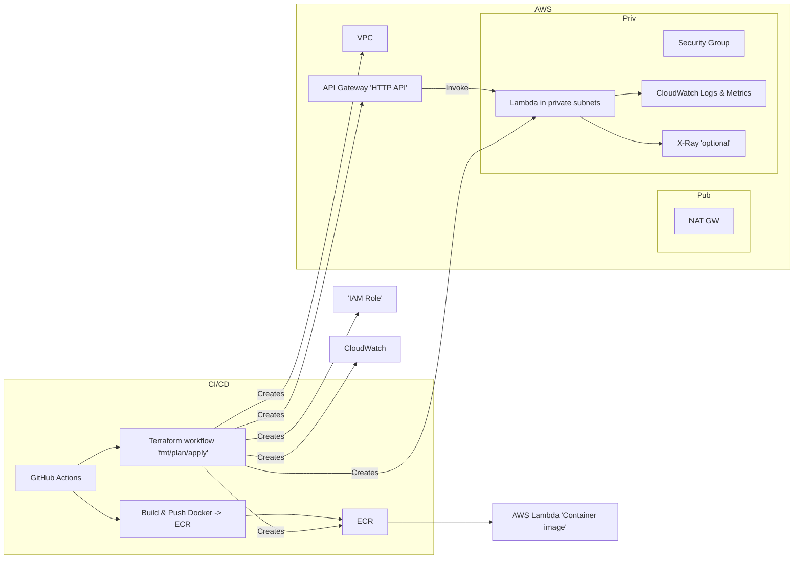
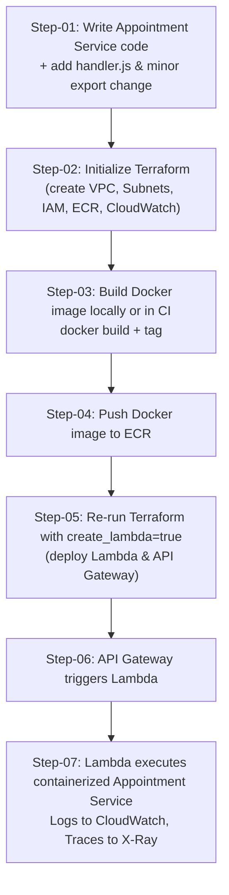

### Architecture (Mermaid) diagram



---

### Step-by-step process (sequence)

1. Write / update service code

* Apply the single-line guard change (replace `app.listen(...)` as shown above) and export `app`.

* Add `handler.js` which exports `handler` via `serverless-http`.

2. Create Terraform infra (first pass)

* Run `terraform init` and `terraform apply` with default `create_lambda=false`. This will create:

  * VPC, public & private subnets, NAT
  * ECR repository
  * IAM role & policy attachments (Lambda basic, VPC access, X-Ray)
  * CloudWatch Log Group
  * (No Lambda nor API Gateway yet)

Example:
```bash
cd terraform
terraform init
terraform apply -auto-approve -var="aws_region=us-east-1"
```
* After apply, note the `ecr_repository_url` output (e.g. `123456789012.dkr.ecr.us-east-1.amazonaws.com/appointment-servic`).

3. Build & push Docker image (locally or via CI)

* Build and tag using the ECR repo URL:

```bash
ACCOUNT_ID=$(aws sts get-caller-identity --query Account --output text)
REGION=us-east-1
ECR_URI="${ACCOUNT_ID}.dkr.ecr.${REGION}.amazonaws.com/appointment-service:latest"

# create repo authentication & push
aws ecr get-login-password --region ${REGION} | docker login --username AWS --password-stdin ${ACCOUNT_ID}.dkr.ecr.${REGION}.amazonaws.com
docker build -t appointment-service:latest .
docker tag appointment-service:latest ${ECR_URI}
docker push ${ECR_URI}
```
* Or let GitHub Actions run the build-and-push workflow (recommended for CI).

4. Create Lambda + API Gateway

* Now re-run Terraform with `create_lambda=true` and `lambda_image_uri=<ECR_URI>`:

```bash
terraform apply -var="create_lambda=true" -var="lambda_image_uri=${ECR_URI}" -auto-approve
```

* Terraform will create the Lambda (container image), API Gateway, route & stage, and a lambda permission for the API.

5. Invoke the service

* Once apply finishes, grab the `api_endpoint` output (or visit `https://<api-id>.execute-api.<region>.amazonaws.com`) and call endpoints:
    * GET /health
    * GET /appointments
    * etc.

6. Continuous updates (push new images)

* Use the GitHub Actions `build-and-push` job to push a new image and run:
```bash
aws lambda update-function-code --function-name appointment-service --image-uri ${ECR_URI}
```
* Alternatively, set `ignore_changes = [image_uri]` in Terraform (as included) and use CLI updates OR remove `ignore_changes` and re-run `terraform apply` once you update `lambda_image_uri`.

7. Monitoring & tracing

* CloudWatch collects logs `/aws/lambda/appointment-service`.
* If `enable_xray=true` (default), Lambda has active tracing; you can view traces in X-Ray console.

---

**Quick checklist / secrets and IAM needs**

* GitHub secrets (at minimum):
  * `AWS_ACCESS_KEY_ID`, `AWS_SECRET_ACCESS_KEY` (user/role with permissions: ECR push, Lambda update, IAM read, CloudWatch logs, X-Ray write if used, API Gateway create/update, VPC resources)
  * `AWS_REGION` (e.g., `us-east-1`)
  * Optionally `TF_VAR_lambda_image_uri`, `TF_VAR_create_lambda` if you want `Terraform apply` to auto-create Lambda from CI.

* Minimal IAM permissions required for the GitHub Actions user:
  * `ecr:*` (create repo, push)
  * `lambda:UpdateFunctionCode`, `lambda:CreateFunction`, `lambda:GetFunction`
  * `iam:PassRole` (for Lambda service role if Terraform creates it)
  * `apigateway:*` (or `apigatewayv2:*` for HTTP API)
  * `ec2:*` for VPC subnet/nat setup (if Terraform runs in CI)
  * `logs:*` for CloudWatch (writing log groups if needed)
  * For production, scope to least privileged as needed.

---

**Extra notes, tips & alternatives**

* I used AWS Lambda base image `public.ecr.aws/lambda/nodejs:18` in the `Dockerfile` — that's the recommended image for Node Lambda containers.

* You can remove `lifecycle.ignore_changes = [image_uri]` if you want Terraform to manage every image update (but then `terraform apply` must be run whenever you push images).

* If you prefer the Lambda function to be public (not in private subnets), remove `vpc_config` in the lambda resource; but that will make the function internet-accessible when attached to API Gateway (still OK because API Gateway is the public entry point).

* For local testing without Lambda you can still run `npm start` (the guarded `app.listen` preserves local server behavior).

* If you want to use `@vendia/serverless-express` instead of `serverless-http`, I can provide that alternative quickly.

---
**Recap / TL;DR**

* Minimal code change: replace `app.listen(...)` with the guarded block and add `module.exports = app;`.

* Use the provided `Dockerfile` + `handler.js` + `package.json`.

* Run Terraform in two steps:

    1. `create_lambda = false` to create VPC/ECR/roles.
    2. Push image to ECR.
    3. `create_lambda = true` + `lambda_image_uri` to create Lambda and API Gateway.

* Or let the supplied GitHub Actions workflows do build/push and terraform apply for you.

* CloudWatch and X-Ray are enabled (X-Ray optional; enabled by default).

---
**Folder Structure**

```css
appointment-service-infra/
├── .github/
│   └── workflows/
│       ├── terraform.yml
│       ├── docker.yml
│       └── lambda-update.yml
├── modules/
│   ├── vpc/
│   │   └── main.tf
│   ├── iam/
│   │   └── main.tf
│   ├── ecr/
│   │   └── main.tf
│   ├── lambda/
│   │   └── main.tf
│   └── apigateway/
│       └── main.tf
├── docker/
│   ├── Dockerfile
│   ├── appointment-service.js
│   ├── handler.js
│   └── package.json
├── main.tf
├── variables.tf
├── outputs.tf
├── provider.tf
└── postman_collection.json
```

---



* How to read this:
  * Step-01: Prepare your Node.js app for Lambda (module.exports = app; + handler.js).
  * Step-02: Run Terraform (infra-only, no Lambda yet).
  * Step-03: Build Docker image with AWS Lambda base image.
  * Step-04: Push Docker image to the ECR repo Terraform created.
  * Step-05: Rerun Terraform with create_lambda=true to provision Lambda + API Gateway.
  * Step-06: Clients hit API Gateway, which invokes Lambda.
  * Step-07: Lambda runs the containerized Appointment Service, logs to CloudWatch, and optionally traces with X-Ray.
 
---
