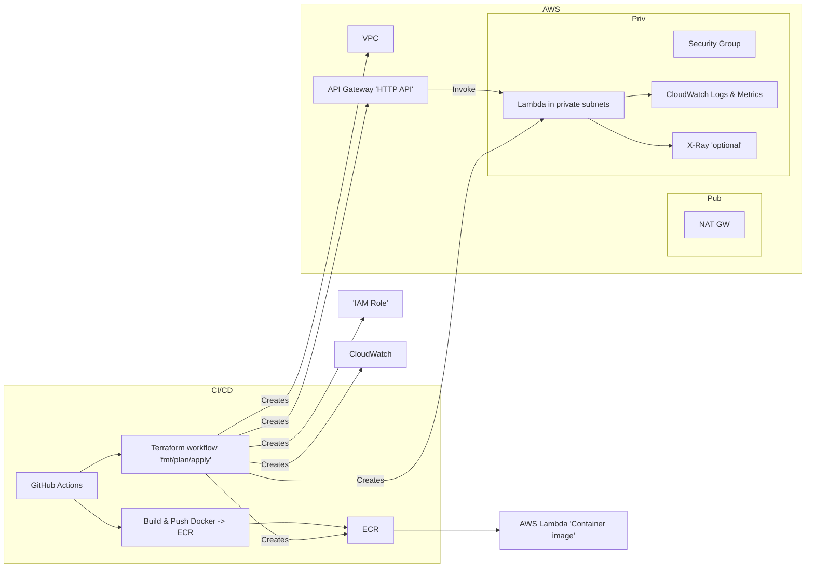
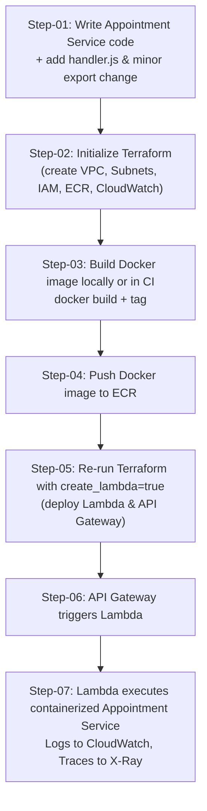

<h3 align="center"><strong>Runnable setup to deploy your Microservices using AWS Lambda</strong></h3>

---

### Small code change required in your services

**Port Issue:**

* Both the **Appointment-service.js** and **Patient-service.js** calls `app.listen(...)`. 
* **Lambda (even with container support)** won’t work unless you remove `app.listen`, because Lambda does not allow a server to bind to a port.
* In Lambda you should not call app.listen (Lambda runs via handler). Minimal change: replace the app.listen(...) line with the guarded block below and export app so the Lambda handler (handler.js) can wrap it.

Change these lines at the bottom of services.

Replace:
```js
app.listen(port, '0.0.0.0', () => {
  console.log(`Appointment service listening at http://0.0.0.0:${port}`);
});
```
With (exact replacement — only these lines):
```js
// Only start a standalone HTTP server when NOT running inside Lambda
if (!process.env.AWS_LAMBDA_FUNCTION_NAME) {
  app.listen(port, '0.0.0.0', () => {
    console.log(`Appointment service listening at http://0.0.0.0:${port}`);
  });
}

module.exports = app; // export for the Lambda handler wrapper
```
This is the only change you need in the app source to support both running locally (npm start) and running inside AWS Lambda container images.

---
#### Codes After Change

**Patient-service.js**
```js
const express = require('express');
    const app = express();
    const port = process.env.PORT || 3000;
    
    app.use(express.json());
    
    // In-memory data store (replace with a database in a real application)
    let patients = [
      { id: '1', name: 'John Doe', age: 30, condition: 'Healthy' },
      { id: '2', name: 'Jane Smith', age: 45, condition: 'Hypertension' }
    ];
    
    app.get('/health', (req, res) => {
      res.status(200).json({ status: 'OK', service: 'Patient Service' });
    });
    
    app.get('/patients', (req, res) => {
      res.json({ 
        message: 'Patients retrieved successfully',
        count: patients.length,
        patients: patients 
      });
    });
    
    app.get('/patients/:id', (req, res) => {
      const patient = patients.find(p => p.id === req.params.id);
      if (patient) {
        res.json({ 
          message: 'Patient found',
          patient: patient 
        });
      } else {
        res.status(404).json({ error: 'Patient not found' });
      }
    });
    
    app.post('/patients', (req, res) => {
      try {
        const { name, age, condition } = req.body;
        if (!name || !age) {
          return res.status(400).json({ error: 'Name and age are required' });
        }
        const newPatient = {
          id: (patients.length + 1).toString(),
          name,
          age,
          condition: condition || 'Not specified'
        };
        patients.push(newPatient);
        res.status(201).json({ 
          message: 'Patient added successfully',
          patient: newPatient 
        });
      } catch (error) {
        res.status(500).json({ error: 'Internal server error' });
      }
    });
    
    // Only start a standalone HTTP server when NOT running inside Lambda
    if (!process.env.AWS_LAMBDA_FUNCTION_NAME) {
    app.listen(port, '0.0.0.0', () => {
        console.log(`Appointment service listening at http://0.0.0.0:${port}`);
    });
    }

    module.exports = app; // export for the Lambda handler wrapper
```
**Appointment-service.js
```js
const express = require('express');
    const app = express();
    const port = process.env.PORT || 3001;
    
    app.use(express.json());
    
    // In-memory data store (replace with a database in a real application)
    let appointments = [
      { id: '1', patientId: '1', date: '2023-06-15', time: '10:00', doctor: 'Dr. Smith' },
      { id: '2', patientId: '2', date: '2023-06-16', time: '14:30', doctor: 'Dr. Johnson' }
    ];
    
    app.get('/health', (req, res) => {
      res.status(200).json({ status: 'OK', service: 'Appointment Service' });
    });
    
    app.get('/appointments', (req, res) => {
      res.json({ 
        message: 'Appointments retrieved successfully',
        count: appointments.length,
        appointments: appointments 
      });
    });
    
    app.get('/appointments/:id', (req, res) => {
      const appointment = appointments.find(a => a.id === req.params.id);
      if (appointment) {
        res.json({ 
          message: 'Appointment found',
          appointment: appointment 
        });
      } else {
        res.status(404).json({ error: 'Appointment not found' });
      }
    });
    
    app.post('/appointments', (req, res) => {
      try {
        const { patientId, date, time, doctor } = req.body;
        if (!patientId || !date || !time || !doctor) {
          return res.status(400).json({ error: 'Patient ID, date, time, and doctor are required' });
        }
        const newAppointment = {
          id: (appointments.length + 1).toString(),
          patientId,
          date,
          time,
          doctor
        };
        appointments.push(newAppointment);
        res.status(201).json({ 
          message: 'Appointment scheduled successfully',
          appointment: newAppointment 
        });
      } catch (error) {
        res.status(500).json({ error: 'Internal server error' });
      }
    });
    
    app.get('/appointments/patient/:patientId', (req, res) => {
      try {
        const patientId = req.params.patientId;
        const patientAppointments = appointments.filter(appt => appt.patientId === patientId);
        if (patientAppointments.length > 0) {
          res.json({
            message: `Found ${patientAppointments.length} appointment(s) for patient ${patientId}`,
            appointments: patientAppointments
          });
        } else {
          res.status(404).json({ message: `No appointments found for patient ${patientId}` });
        }
      } catch (error) {
        res.status(500).json({ error: 'Internal server error' });
      }
    });
    
    // Only start a standalone HTTP server when NOT running inside Lambda
    if (!process.env.AWS_LAMBDA_FUNCTION_NAME) {
    app.listen(port, '0.0.0.0', () => {
        console.log(`Appointment service listening at http://0.0.0.0:${port}`);
    });
    }

    module.exports = app; // export for the Lambda handler wrapper
```
---

### Files & Contents

1) Terraform — `main.tf` (single-file, self-contained)

ave as terraform/main.tf. It creates VPC, subnets, NAT, ECR repo, IAM role & attachments, security group, CloudWatch log group, and (optionally) Lambda + API Gateway when you enable create_lambda = true. This avoids failing on first terraform apply when the image hasn't been pushed yet.

```hcl
terraform {
  required_version = ">= 1.0.0"
  required_providers {
    aws = {
      source  = "hashicorp/aws"
      version = "~> 4.0"
    }
  }
}

provider "aws" {
  region = var.aws_region
}

data "aws_caller_identity" "current" {}

####################
# Variables (can be overridden via -var or TF_VAR_*)
####################
variable "aws_region" {
  type    = string
  default = "us-east-1"
}

variable "create_lambda" {
  description = "Set to true after you push the container image. When false, Terraform creates infra but not Lambda/API."
  type        = bool
  default     = false
}

variable "lambda_image_uri" {
  description = "ECR image URI (example: <account>.dkr.ecr.<region>.amazonaws.com/appointment-service:latest). Required when create_lambda = true."
  type        = string
  default     = ""
}

variable "lambda_memory" {
  type    = number
  default = 512
}

variable "lambda_timeout" {
  type    = number
  default = 15
}

variable "enable_xray" {
  description = "Enable AWS X-Ray tracing for Lambda"
  type        = bool
  default     = true
}

####################
# Basic networking (VPC, subnets, NAT)
####################
resource "aws_vpc" "this" {
  cidr_block           = "10.0.0.0/16"
  enable_dns_support   = true
  enable_dns_hostnames = true
  tags = { Name = "appt-vpc" }
}

# Public subnets (2)
resource "aws_subnet" "public" {
  count                   = 2
  vpc_id                  = aws_vpc.this.id
  cidr_block              = cidrsubnet(aws_vpc.this.cidr_block, 8, count.index + 1) # 10.0.1.0/24, 10.0.2.0/24
  availability_zone       = data.aws_availability_zones.available.names[count.index]
  map_public_ip_on_launch = true
  tags = { Name = "public-${count.index + 1}" }
}

# Private subnets (2)
resource "aws_subnet" "private" {
  count             = 2
  vpc_id            = aws_vpc.this.id
  cidr_block        = cidrsubnet(aws_vpc.this.cidr_block, 8, 100 + count.index) # 10.0.100.0/24, 10.0.101.0/24
  availability_zone = data.aws_availability_zones.available.names[count.index]
  tags = { Name = "private-${count.index + 1}" }
}

data "aws_availability_zones" "available" {}

resource "aws_internet_gateway" "igw" {
  vpc_id = aws_vpc.this.id
  tags   = { Name = "igw" }
}

resource "aws_route_table" "public" {
  vpc_id = aws_vpc.this.id
  route {
    cidr_block = "0.0.0.0/0"
    gateway_id = aws_internet_gateway.igw.id
  }
  tags = { Name = "public-rt" }
}

resource "aws_route_table_association" "public_assoc" {
  count          = length(aws_subnet.public)
  subnet_id      = aws_subnet.public[count.index].id
  route_table_id = aws_route_table.public.id
}

# NAT Gateway (single) + EIP
resource "aws_eip" "nat_eip" {
  vpc = true
}

resource "aws_nat_gateway" "nat" {
  allocation_id = aws_eip.nat_eip.id
  subnet_id     = aws_subnet.public[0].id
  tags = { Name = "nat-gw" }
}

resource "aws_route_table" "private" {
  vpc_id = aws_vpc.this.id
  route {
    cidr_block     = "0.0.0.0/0"
    nat_gateway_id = aws_nat_gateway.nat.id
  }
  tags = { Name = "private-rt" }
}

resource "aws_route_table_association" "private_assoc" {
  count          = length(aws_subnet.private)
  subnet_id      = aws_subnet.private[count.index].id
  route_table_id = aws_route_table.private.id
}

####################
# Security group for Lambda (egress allowed)
####################
resource "aws_security_group" "lambda_sg" {
  name        = "lambda-sg"
  description = "Lambda SG - allow outbound"
  vpc_id      = aws_vpc.this.id

  egress {
    from_port   = 0
    to_port     = 0
    protocol    = "-1"
    cidr_blocks = ["0.0.0.0/0"]
  }

  tags = { Name = "lambda-sg" }
}

####################
# ECR repository
####################
resource "aws_ecr_repository" "appointment" {
  name                 = "appointment-service"
  image_tag_mutability = "MUTABLE"
  image_scanning_configuration { scan_on_push = true }
  tags = { Name = "appointment-ecr" }
}

####################
# IAM role for Lambda
####################
data "aws_iam_policy_document" "lambda_assume" {
  statement {
    actions = ["sts:AssumeRole"]
    principals {
      type        = "Service"
      identifiers = ["lambda.amazonaws.com"]
    }
  }
}

resource "aws_iam_role" "lambda_role" {
  name               = "lambda-exec-role-appointment"
  assume_role_policy = data.aws_iam_policy_document.lambda_assume.json
  tags = { Name = "lambda-role-appointment" }
}

# Attach managed policies
resource "aws_iam_role_policy_attachment" "lambda_basic" {
  role       = aws_iam_role.lambda_role.name
  policy_arn = "arn:aws:iam::aws:policy/service-role/AWSLambdaBasicExecutionRole"
}

resource "aws_iam_role_policy_attachment" "vpc_access" {
  role       = aws_iam_role.lambda_role.name
  policy_arn = "arn:aws:iam::aws:policy/service-role/AWSLambdaVPCAccessExecutionRole"
}

resource "aws_iam_role_policy_attachment" "xray" {
  count      = var.enable_xray ? 1 : 0
  role       = aws_iam_role.lambda_role.name
  policy_arn = "arn:aws:iam::aws:policy/AWSXRayDaemonWriteAccess"
}

####################
# CloudWatch Log Group (optional: created upfront)
####################
resource "aws_cloudwatch_log_group" "appointment_log" {
  name              = "/aws/lambda/appointment-service"
  retention_in_days = 14
}

####################
# Lambda function (created only when create_lambda = true)
####################
resource "aws_lambda_function" "appointment" {
  count        = var.create_lambda ? 1 : 0
  function_name = "appointment-service"
  package_type  = "Image"
  image_uri     = var.lambda_image_uri
  role          = aws_iam_role.lambda_role.arn
  memory_size   = var.lambda_memory
  timeout       = var.lambda_timeout

  # Put Lambda in private subnets so it is not directly internet-facing
  vpc_config {
    subnet_ids         = aws_subnet.private[*].id
    security_group_ids = [aws_security_group.lambda_sg.id]
  }

  tracing_config {
    mode = var.enable_xray ? "Active" : "PassThrough"
  }

  environment {
    variables = {
      NODE_ENV = "production"
    }
  }

  tags = { Name = "appointment-lambda" }
  lifecycle {
    ignore_changes = [image_uri] # optional: if you prefer CLI updates vs terraform-managed image changes
  }
}

####################
# API Gateway v2 (HTTP API) & integration (created only when lambda exists)
####################
resource "aws_apigatewayv2_api" "http_api" {
  count         = var.create_lambda ? 1 : 0
  name          = "appointment-http-api"
  protocol_type = "HTTP"
}

resource "aws_apigatewayv2_integration" "lambda_integration" {
  count                   = var.create_lambda ? 1 : 0
  api_id                  = aws_apigatewayv2_api.http_api[0].id
  integration_type        = "AWS_PROXY"
  integration_method      = "POST"
  integration_uri         = "arn:aws:apigateway:${var.aws_region}:lambda:path/2015-03-31/functions/${aws_lambda_function.appointment[0].arn}/invocations"
  payload_format_version  = "2.0"
}

resource "aws_apigatewayv2_route" "default" {
  count  = var.create_lambda ? 1 : 0
  api_id = aws_apigatewayv2_api.http_api[0].id
  route_key = "$default"
  target    = "integrations/${aws_apigatewayv2_integration.lambda_integration[0].id}"
}

resource "aws_apigatewayv2_stage" "default" {
  count      = var.create_lambda ? 1 : 0
  api_id     = aws_apigatewayv2_api.http_api[0].id
  name       = "$default"
  auto_deploy = true
}

# Give API Gateway permission to invoke the Lambda function
resource "aws_lambda_permission" "apigw_invoke" {
  count        = var.create_lambda ? 1 : 0
  statement_id = "AllowAPIGWInvoke"
  action       = "lambda:InvokeFunction"
  function_name = aws_lambda_function.appointment[0].arn
  principal    = "apigateway.amazonaws.com"
  source_arn   = "arn:aws:execute-api:${var.aws_region}:${data.aws_caller_identity.current.account_id}:${aws_apigatewayv2_api.http_api[0].id}/*/*/*"
}

####################
# Outputs
####################
output "ecr_repository_url" {
  value = aws_ecr_repository.appointment.repository_url
}

output "api_endpoint" {
  value       = var.create_lambda ? aws_apigatewayv2_api.http_api[0].api_endpoint : "disabled (create_lambda=false)"
  description = "HTTP API endpoint once create_lambda=true and Lambda/API are created"
}
```
Notes about running this Terraform:

* First run with `create_lambda = false` (default). That creates VPC, ECR repo, IAM role, CloudWatch log group, etc.
* Then push the docker image into the `aws_ecr_repository.appointment.repository_url` (I show the GitHub Actions for this below). After pushing the image, set `create_lambda = true` and `lambda_image_uri = "<your-ecr-uri>:<tag>"` and re-run `terraform apply` to create the Lambda + API Gateway in the same run.
* I used `lifecycle.ignore_changes = [image_uri]` so you can push new images and update the Lambda via the AWS CLI or GitHub Actions instead of re-running Terraform every time you push an image. If you prefer Terraform to manage image updates, remove that ignore rule.

2. Docker / Node files: 

`Dockerfile`

Place at repo root or in /appointment-service/ directory. Uses AWS Lambda Node.js 18 base image (optimized for Lambda container images).

```dockerfile
# Use AWS Lambda base image for Node 18
FROM public.ecr.aws/lambda/nodejs:18

# Create app directory
WORKDIR /var/task

# Copy package files first (for better caching)
COPY package*.json ./

# Install only production dependencies
RUN npm ci --only=production

# Copy application code
COPY . .

# The Lambda RIC will look for the exported handler name (handler.handler)
CMD ["handler.handler"]
```
=====================================================================
> Why Dockerfile optimized for Lambda:

1. Dockerfile for Microservices
   * Each microservice (e.g., Patient service, Appointment service) is a Node.js/Express app.
   * Normally, you’d build a `Dockerfile` that installs Node.js, copies your code, installs dependencies, and runs `node app.js`.
   * That works fine in ECS/EKS/EC2, but Lambda has special requirements.

2. Optimized for Lambda

AWS Lambda doesn’t just run any Docker image—it expects it to follow a Lambda Runtime API format.

So:
   * You need to use AWS-provided Lambda base images (`public.ecr.aws/lambda/nodejs:18`, etc.) instead of generic `node:18`.
   * Your app must start with the Lambda entry point, not `node app.js`.

AWS base images come with:
   * Lambda Runtime Interface Client (RIC) → handles requests from API Gateway or EventBridge.
   * Correct ENTRYPOINT → already wired for Lambda.

3. Key Optimizations

* Small image size → use `node:18-alpine` when layering dependencies, then copy into lambda base image.
* Handler file → instead of running Express directly, you wrap it with `aws-serverless-express` or `@vendia/serverless-express`.
* Two-stage build → build dependencies in one stage, copy only what you need into final image (to reduce size).
* Environment Variables → configure `PORT`, `NODE_ENV`, etc.
* Lambda CMD → always point to your handler, e.g. `CMD ["app.handler"]`.

4. Typical Dockerfile (Lambda-optimized, Node.js + Express)

```dockerfile
# Step 1: Build dependencies
FROM node:18-alpine AS builder
WORKDIR /app
COPY package*.json ./
RUN npm install --production
COPY . .

# Step 2: Lambda Runtime Base Image
FROM public.ecr.aws/lambda/nodejs:18

# Copy built code from builder
COPY --from=builder /app ./

# Command for Lambda (handler function)
# If using @vendia/serverless-express, your app exports a handler
CMD ["app.handler"]
```

5. How This Differs From Normal Dockerfile

| Normal Dockerfile         | Lambda-Optimized Dockerfile            |
| ------------------------- | -------------------------------------- |
| Uses `node:18`            | Uses `public.ecr.aws/lambda/nodejs:18` |
| `CMD ["node", "app.js"]`  | `CMD ["app.handler"]`                  |
| Meant for ECS/EC2 servers | Meant for Lambda container runtime     |
| Runs continuously         | Runs only when invoked                 |

**In short:**

This means building Docker images for each microservice using AWS Lambda’s base images, lightweight builds, and a handler entry point instead of a long-running server process.

=============================================================

`.dockerignore`
```lua
node_modules
npm-debug.log
.DS_Store
.git
.gitignore
```
`package.json`
```json
{
  "name": "appointment-service",
  "version": "1.0.0",
  "main": "handler.js",
  "scripts": {
    "start": "node Appointment-service.js"
  },
  "dependencies": {
    "express": "^4.18.2",
    "serverless-http": "^3.0.0"
  }
}
```
`handler.js`

(This file wraps your exported Express app into a Lambda-compatible handler using serverless-http.)
```js
const serverless = require('serverless-http');
const app = require('./Appointment-service'); // requires the exported app

module.exports.handler = serverless(app);
```

`Patient-service.js`

Keep your code as is but apply the small replacement shown earlier to guard app.listen and add module.exports = app; at the bottom. (I included the exact replacement earlier.)

`Appointment-service.js`

Keep your code as is but apply the small replacement shown earlier to guard app.listen and add module.exports = app; at the bottom. (I included the exact replacement earlier.)

3) GitHub Actions workflows

A) Build & push Docker image + update Lambda — `.github/workflows/build-and-push-image.yml`

This workflow builds Docker, logs into ECR, pushes :latest (or tag), and then calls AWS CLI to update the Lambda image URI (so you can push images frequently without re-running Terraform).

```yaml
name: Build and Push Docker image & Update Lambda
on:
  push:
    paths:
      - 'Appointment-service/**'
      - 'package.json'
      - 'Dockerfile'
      - '.github/workflows/build-and-push-image.yml'

jobs:
  build-and-push:
    runs-on: ubuntu-latest
    env:
      AWS_REGION: ${{ secrets.AWS_REGION }}
    steps:
      - name: Checkout
        uses: actions/checkout@v4

      - name: Configure AWS credentials
        uses: aws-actions/configure-aws-credentials@v2
        with:
          aws-access-key-id: ${{ secrets.AWS_ACCESS_KEY_ID }}
          aws-secret-access-key: ${{ secrets.AWS_SECRET_ACCESS_KEY }}
          aws-region: ${{ secrets.AWS_REGION }}

      - name: Get AWS Account ID
        id: account
        run: |
          echo "::set-output name=account::$(aws sts get-caller-identity --query Account --output text)"

      - name: Login to ECR
        uses: aws-actions/amazon-ecr-login@v1

      - name: Build Docker image
        run: |
          ACCOUNT_ID=${{ steps.account.outputs.account }}
          REGION=${{ secrets.AWS_REGION }}
          ECR_REPO_NAME=appointment-service
          IMAGE_URI="${ACCOUNT_ID}.dkr.ecr.${REGION}.amazonaws.com/${ECR_REPO_NAME}:latest"
          docker build -t "${ECR_REPO_NAME}:latest" .
          docker tag "${ECR_REPO_NAME}:latest" "${IMAGE_URI}"
          echo "IMAGE_URI=${IMAGE_URI}" >> $GITHUB_ENV

      - name: Push to ECR
        run: |
          docker push "$IMAGE_URI"

      - name: Update Lambda function image (CLI)
        if: always()
        run: |
          FUNCTION_NAME="appointment-service"
          aws lambda update-function-code --function-name ${FUNCTION_NAME} --image-uri ${IMAGE_URI}
```
Secrets you must add to the GitHub repo:

* `AWS_ACCESS_KEY_ID` and `AWS_SECRET_ACCESS_KEY` (an IAM user with ECR push, Lambda update, and related permissions)
* `AWS_REGION` (e.g., `us-east-1`)

> The workflow updates Lambda directly with aws lambda update-function-code --image-uri. If you want Terraform to manage image updates instead, remove the last step and run terraform apply in a separate workflow (I provide a Terraform workflow below).

=======================================================================================================
**Docker Image Tag Issue**

in CI/CD pipelines, using `:latest` is risky because it’s not immutable. In GitHub Actions you can automatically tag your Docker images with either:

* Git commit SHA (immutable, unique)
* Git tag / release version (if you’re tagging releases)
* Branch name (for dev environments)

Example: GitHub Actions workflow using commit SHA
```yaml
name: Build and Push Docker Image

on:
  push:
    branches:
      - main

jobs:
  build:
    runs-on: ubuntu-latest

    steps:
      - name: Checkout code
        uses: actions/checkout@v3

      - name: Log in to Amazon ECR
        id: login-ecr
        uses: aws-actions/amazon-ecr-login@v2

      - name: Build, tag, and push image
        env:
          ECR_REGISTRY: ${{ steps.login-ecr.outputs.registry }}
          ECR_REPOSITORY: patient-service
          IMAGE_TAG: ${{ github.sha }}
        run: |
          docker build -t $ECR_REGISTRY/$ECR_REPOSITORY:$IMAGE_TAG .
          docker push $ECR_REGISTRY/$ECR_REPOSITORY:$IMAGE_TAG
```
Here:

* `${{ github.sha }}` → unique commit SHA
* Each push creates a new immutable image in ECR.

Example: Use branch or tag name
```yaml
IMAGE_TAG: ${{ github.ref_name }}
```
* If pushing on branch `main` → tag = `main`
* If pushing a GitHub Release tag `v1.0.0` → tag = `v1.0.0`

Best practice:

* Use SHA for deployments (`:abc123`)
* Optionally also tag with branch or version (`:main`, `:v1.0.0`) for readability

> if SHA id is long, how can i reduce it to last 4 to 5 ?

yes, the Git commit SHA is usually 40 characters long, but in GitHub Actions you can easily shorten it.

You can use the shell’s substring feature on `${GITHUB_SHA}`.

Example: shorten SHA to 7 chars (common practice like `git rev-parse --short`)

```yaml
      - name: Set short SHA
        run: echo "SHORT_SHA=${GITHUB_SHA::7}" >> $GITHUB_ENV
```
This creates an environment variable `SHORT_SHA` with just the first 7 chars.

Full Example with Docker push
```yaml
      - name: Build, tag, and push image
        env:
          ECR_REGISTRY: ${{ steps.login-ecr.outputs.registry }}
          ECR_REPOSITORY: patient-service
        run: |
          SHORT_SHA=${GITHUB_SHA::7}
          docker build -t $ECR_REGISTRY/$ECR_REPOSITORY:$SHORT_SHA .
          docker push $ECR_REGISTRY/$ECR_REPOSITORY:$SHORT_SHA
```
If you want last 5 chars instead of first 7
```yaml
SHORT_SHA=$(echo $GITHUB_SHA | tail -c 6)  # last 5 chars (+ newline safety)
```

Common convention is first 7 chars, since that’s what `git log --oneline` shows. But if you want last 5, you can still do it — just be consistent across your builds and deployments.

===========================================================================

B) Terraform workflow — `.github/workflows/terraform.yml`

This one does fmt/plan/apply. Keep in mind sensitive operations (apply) usually require approvals or restricted branches.
```yaml
name: Terraform CI

on:
  pull_request:
    paths:
      - 'terraform/**'
  workflow_dispatch:
  push:
    branches:
      - main
    paths:
      - 'terraform/**'

jobs:
  fmt:
    name: Terraform fmt
    runs-on: ubuntu-latest
    steps:
      - uses: actions/checkout@v4
      - name: Setup Terraform
        uses: hashicorp/setup-terraform@v2
        with:
          terraform_version: 1.5.0
      - name: Terraform fmt
        run: |
          terraform -chdir=terraform fmt -check

  plan:
    name: Terraform Plan
    runs-on: ubuntu-latest
    needs: fmt
    steps:
      - uses: actions/checkout@v4
      - name: Setup Terraform
        uses: hashicorp/setup-terraform@v2
        with:
          terraform_version: 1.5.0
      - name: Terraform Init
        run: terraform -chdir=terraform init
      - name: Terraform Plan
        run: terraform -chdir=terraform plan -no-color -out=tfplan -var="aws_region=${{ secrets.AWS_REGION }}" || true
      - name: Save Plan
        uses: actions/upload-artifact@v4
        with:
          name: tfplan
          path: terraform/tfplan

  apply:
    name: Terraform Apply
    runs-on: ubuntu-latest
    needs: plan
    if: github.ref == 'refs/heads/main' # only auto apply on main (adjust as needed)
    steps:
      - uses: actions/checkout@v4
      - name: Setup Terraform
        uses: hashicorp/setup-terraform@v2
        with:
          terraform_version: 1.5.0
      - name: Configure AWS credentials
        uses: aws-actions/configure-aws-credentials@v2
        with:
          aws-access-key-id: ${{ secrets.AWS_ACCESS_KEY_ID }}
          aws-secret-access-key: ${{ secrets.AWS_SECRET_ACCESS_KEY }}
          aws-region: ${{ secrets.AWS_REGION }}
      - name: Terraform Init
        run: terraform -chdir=terraform init
      - name: Terraform Apply
        run: terraform -chdir=terraform apply -auto-approve -var="aws_region=${{ secrets.AWS_REGION }}" -var="create_lambda=${{ secrets.TF_VAR_create_lambda || 'false' }}" -var="lambda_image_uri=${{ secrets.TF_VAR_lambda_image_uri || '' }}"
```

Secrets (Terraform workflow):

* `AWS_ACCESS_KEY_ID`, `AWS_SECRET_ACCESS_KEY`, `AWS_REGION`
* Optionally: `TF_VAR_create_lambda` and `TF_VAR_lambda_image_uri` to auto-create the Lambda during apply. If you prefer manual control, set `create_lambda = false` and only enable after you pushed the image.

---

### Step by Step Process

### Architecture (Mermaid) diagram



---

### Step-by-step process (sequence)

1. Write / update service code

* Apply the single-line guard change (replace `app.listen(...)` as shown above) and export `app`.

* Add `handler.js` which exports `handler` via `serverless-http`.

2. Create Terraform infra (first pass)

* Run `terraform init` and `terraform apply` with default `create_lambda=false`. This will create:

  * VPC, public & private subnets, NAT
  * ECR repository
  * IAM role & policy attachments (Lambda basic, VPC access, X-Ray)
  * CloudWatch Log Group
  * (No Lambda nor API Gateway yet)

Example:
```bash
cd terraform
terraform init
terraform apply -auto-approve -var="aws_region=us-east-1"
```
* After apply, note the `ecr_repository_url` output (e.g. `123456789012.dkr.ecr.us-east-1.amazonaws.com/appointment-servic`).

3. Build & push Docker image (locally or via CI)

* Build and tag using the ECR repo URL:

```bash
ACCOUNT_ID=$(aws sts get-caller-identity --query Account --output text)
REGION=us-east-1
ECR_URI="${ACCOUNT_ID}.dkr.ecr.${REGION}.amazonaws.com/appointment-service:latest"

# create repo authentication & push
aws ecr get-login-password --region ${REGION} | docker login --username AWS --password-stdin ${ACCOUNT_ID}.dkr.ecr.${REGION}.amazonaws.com
docker build -t appointment-service:latest .
docker tag appointment-service:latest ${ECR_URI}
docker push ${ECR_URI}
```
* Or let GitHub Actions run the build-and-push workflow (recommended for CI).

4. Create Lambda + API Gateway

* Now re-run Terraform with `create_lambda=true` and `lambda_image_uri=<ECR_URI>`:

```bash
terraform apply -var="create_lambda=true" -var="lambda_image_uri=${ECR_URI}" -auto-approve
```

* Terraform will create the Lambda (container image), API Gateway, route & stage, and a lambda permission for the API.

5. Invoke the service

* Once apply finishes, grab the `api_endpoint` output (or visit `https://<api-id>.execute-api.<region>.amazonaws.com`) and call endpoints:
    * GET /health
    * GET /appointments
    * etc.

6. Continuous updates (push new images)

* Use the GitHub Actions `build-and-push` job to push a new image and run:
```bash
aws lambda update-function-code --function-name appointment-service --image-uri ${ECR_URI}
```
* Alternatively, set `ignore_changes = [image_uri]` in Terraform (as included) and use CLI updates OR remove `ignore_changes` and re-run `terraform apply` once you update `lambda_image_uri`.

7. Monitoring & tracing

* CloudWatch collects logs `/aws/lambda/appointment-service`.
* If `enable_xray=true` (default), Lambda has active tracing; you can view traces in X-Ray console.


**Quick checklist / secrets and IAM needs**

* GitHub secrets (at minimum):
  * `AWS_ACCESS_KEY_ID`, `AWS_SECRET_ACCESS_KEY` (user/role with permissions: ECR push, Lambda update, IAM read, CloudWatch logs, X-Ray write if used, API Gateway create/update, VPC resources)
  * `AWS_REGION` (e.g., `us-east-1`)
  * Optionally `TF_VAR_lambda_image_uri`, `TF_VAR_create_lambda` if you want `Terraform apply` to auto-create Lambda from CI.

* Minimal IAM permissions required for the GitHub Actions user:
  * `ecr:*` (create repo, push)
  * `lambda:UpdateFunctionCode`, `lambda:CreateFunction`, `lambda:GetFunction`
  * `iam:PassRole` (for Lambda service role if Terraform creates it)
  * `apigateway:*` (or `apigatewayv2:*` for HTTP API)
  * `ec2:*` for VPC subnet/nat setup (if Terraform runs in CI)
  * `logs:*` for CloudWatch (writing log groups if needed)
  * For production, scope to least privileged as needed.


**Extra notes, tips & alternatives**

* I used AWS Lambda base image `public.ecr.aws/lambda/nodejs:18` in the `Dockerfile` — that's the recommended image for Node Lambda containers.

* You can remove `lifecycle.ignore_changes = [image_uri]` if you want Terraform to manage every image update (but then `terraform apply` must be run whenever you push images).

* If you prefer the Lambda function to be public (not in private subnets), remove `vpc_config` in the lambda resource; but that will make the function internet-accessible when attached to API Gateway (still OK because API Gateway is the public entry point).

* For local testing without Lambda you can still run `npm start` (the guarded `app.listen` preserves local server behavior).

* If you want to use `@vendia/serverless-express` instead of `serverless-http`, I can provide that alternative quickly.

**Recap / TL;DR**

* Minimal code change: replace `app.listen(...)` with the guarded block and add `module.exports = app;`.

* Use the provided `Dockerfile` + `handler.js` + `package.json`.

* Run Terraform in two steps:

    1. `create_lambda = false` to create VPC/ECR/roles.
    2. Push image to ECR.
    3. `create_lambda = true` + `lambda_image_uri` to create Lambda and API Gateway.

* Or let the supplied GitHub Actions workflows do build/push and terraform apply for you.

* CloudWatch and X-Ray are enabled (X-Ray optional; enabled by default).

---
**Folder Structure**

```css
appointment-service-infra/
├── .github/
│   └── workflows/
│       ├── terraform.yml
│       ├── docker.yml
│       └── lambda-update.yml
├── modules/
│   ├── vpc/
│   │   └── main.tf
│   ├── iam/
│   │   └── main.tf
│   ├── ecr/
│   │   └── main.tf
│   ├── lambda/
│   │   └── main.tf
│   └── apigateway/
│       └── main.tf
├── docker/
│   ├── Dockerfile
│   ├── appointment-service.js
│   ├── handler.js
│   └── package.json
├── main.tf
├── variables.tf
├── outputs.tf
├── provider.tf
└── postman_collection.json
```



How to read this:

Step-01: Prepare your Node.js app for Lambda (module.exports = app; + handler.js).

Step-02: Run Terraform (infra-only, no Lambda yet).

Step-03: Build Docker image with AWS Lambda base image.

Step-04: Push Docker image to the ECR repo Terraform created.

Step-05: Rerun Terraform with create_lambda=true to provision Lambda + API Gateway.

Step-06: Clients hit API Gateway, which invokes Lambda.

Step-07: Lambda runs the containerized Appointment Service, logs to CloudWatch, and optionally traces with X-Ray.

---
